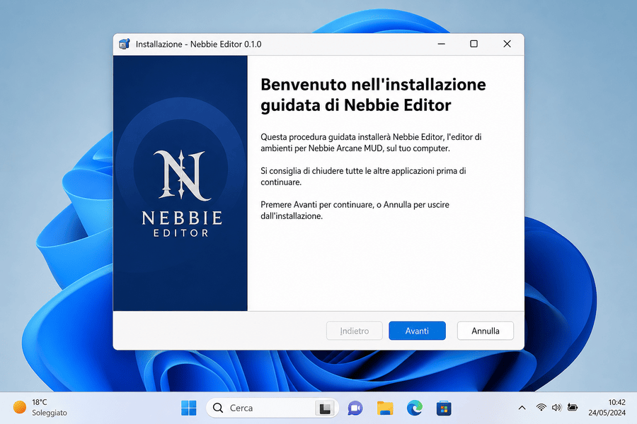
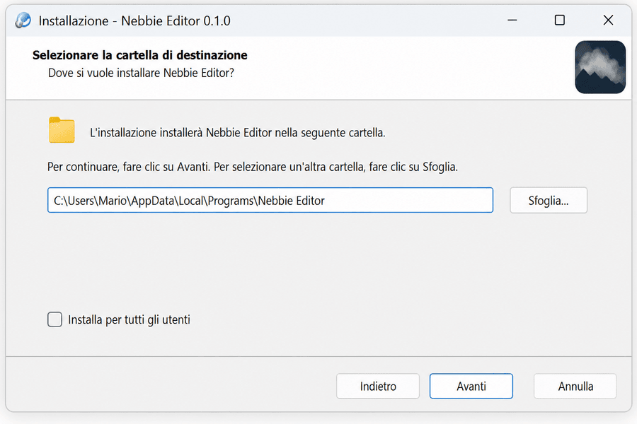
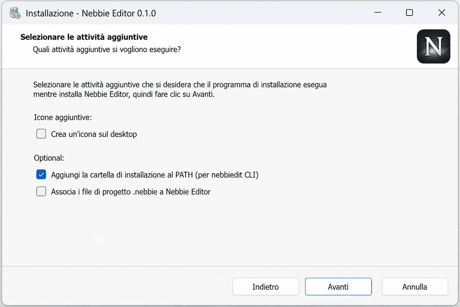
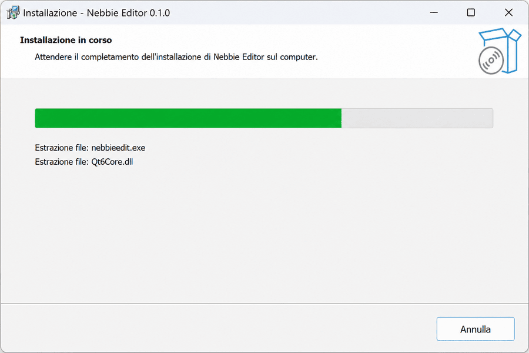
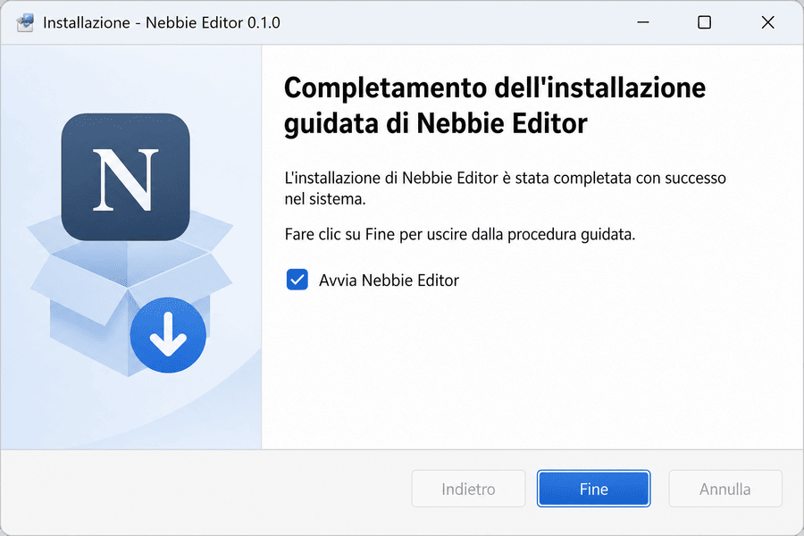

# Manuale di installazione — Nebbie Editor

Editor di mondo per [Nebbie Arcane](https://github.com/NebbieArcane/Server).  
Questo documento descrive in dettaglio le **tre modalità di installazione ufficiali** su Linux, macOS e Windows.

---

## Indice

1. [Panoramica](#panoramica)
2. [Cosa viene installato](#cosa-viene-installato)
3. [Requisiti di sistema](#requisiti-di-sistema)
4. [Dove ottenere i pacchetti](#dove-ottenere-i-pacchetti)
5. [Installazione su Linux (pacchetto `.deb`)](#installazione-su-linux-pacchetto-deb)
6. [Installazione su macOS (immagine `.dmg`)](#installazione-su-macos-immagine-dmg)
7. [Installazione su Windows](#installazione-su-windows)
   - [Opzione A — Zip portatile](#opzione-a--zip-portatile)
   - [Opzione B — Installer `.exe` (Inno Setup)](#opzione-b--installer-exe-inno-setup)
   - [Walkthrough grafico — wizard Windows](#walkthrough-grafico--wizard-windows)
8. [Primo avvio e configurazione](#primo-avvio-e-configurazione)
9. [Verifica dell'installazione](#verifica-dellinstallazione)
10. [Disinstallazione](#disinstallazione)
11. [Risoluzione problemi](#risoluzione-problemi)
12. [Alternative: installazione da sorgente](#alternative-installazione-da-sorgente)
13. [Uso rapido dopo l'installazione](#uso-rapido-dopo-linstallazione)

> **PDF:** [MANUALE_INSTALLAZIONE.pdf](MANUALE_INSTALLAZIONE.pdf) — versione stampabile di questo manuale (rigenerabile con `./scripts/build-manuale-pdf.sh`).

---

## Panoramica

Nebbie Editor è distribuito in tre formati, uno per piattaforma:

| Piattaforma | Formato | File prodotto | Tipo di installazione |
|-------------|---------|---------------|------------------------|
| **Linux** (Debian/Ubuntu) | Pacchetto Debian | `nebbie-editor_<versione>_<arch>.deb` | Gestore pacchetti (`dpkg` / `apt`) |
| **macOS** | Disco immagine | `nebbie-editor_<versione>_macos.dmg` | Trascinamento dell'app in `Applicazioni` |
| **Windows** | Archivio zip **oppure** installer | `nebbie-editor_<versione>_windows.zip` / `nebbie-editor_<versione>_windows_setup.exe` | Estrazione manuale o wizard guidato |

Su tutte le piattaforme sono disponibili **due programmi**:

- **`nebbiedit`** — interfaccia a riga di comando (CLI) per automazione, script e sessioni interattive.
- **`nebbieedit`** — interfaccia grafica Qt per editing visuale di zone, stanze, mob e oggetti.

---

## Cosa viene installato

### Linux (`.deb`)

| Percorso | Contenuto |
|----------|-----------|
| `/usr/bin/nebbiedit` | Eseguibile CLI |
| `/usr/bin/nebbieedit` | Eseguibile GUI |
| `/usr/share/applications/nebbieedit.desktop` | Voce nel menu applicazioni |
| `/usr/share/nebbie-editor/sample-mudroot/lib` | Libreria di prova (`myst.*`, workflow `getworldlocal`) |

Le librerie Qt 6 **non** sono incluse nel pacchetto: vengono installate come dipendenze di sistema tramite `apt`.

### macOS (`.dmg`)

Il disco immagine contiene:

| Elemento | Descrizione |
|----------|-------------|
| `nebbieedit.app` | Applicazione grafica (bundle macOS con runtime Qt incorporato nel build) |
| `bin/nebbiedit` | CLI da terminale |
| `sample-mudroot/lib` | Libreria di prova (`myst.*`) |
| `Applications` | Collegamento simbolico per il drag-and-drop in `/Applications` |

> **Nota:** la CLI `nebbiedit` resta nella cartella `bin/` del volume DMG (o va copiata manualmente, ad es. in `/usr/local/bin`) se si desidera usarla da terminale ovunque.

### Windows (zip o installer)

Entrambe le modalità installano nella cartella scelta:

| File / cartella | Descrizione |
|-----------------|-------------|
| `nebbieedit.exe` | GUI principale |
| `nebbiedit.exe` | CLI |
| `sample-mudroot\lib\` | Libreria di prova (`myst.*`) |
| `nebbieedit.ico` | Icona applicazione |
| `*.dll`, `platforms/`, `styles/`, … | Runtime Qt (incluso via `windeployqt`) |

L'installer aggiunge inoltre:

- Voce nel **menu Start** («Nebbie Editor» e «Nebbie CLI»)
- Opzione **icona sul desktop** (facoltativa)
- Opzione **aggiunta al PATH** per la CLI (facoltativa)

---

## Requisiti di sistema

### Linux

| Requisito | Dettaglio |
|-----------|-----------|
| Distribuzione | Debian, Ubuntu o derivate (pacchetto `.deb`) |
| Architettura | `amd64` (altre architetture solo se compilate manualmente) |
| Sistema | glibc ≥ 2.31 |
| Runtime Qt 6 | `libqt6core6`, `libqt6gui6`, `libqt6widgets6`, `libqt6network6` (o varianti `*t64` su Ubuntu 24.04+) |

### macOS

| Requisito | Dettaglio |
|-----------|-----------|
| Versione macOS | 11.0 (Big Sur) o successiva |
| Architettura | Apple Silicon (arm64) o Intel (x86_64), a seconda del pacchetto compilato |
| Spazio disco | ~5 MB per l'app + spazio per la libreria di mondo |

### Windows

| Requisito | Dettaglio |
|-----------|-----------|
| Sistema | Windows 10/11 a 64 bit |
| Runtime | Visual C++ Redistributable (incluso nel pacchetto Qt deployato) |
| Permessi | Installazione per utente corrente (non richiede amministratore) |

---

## Dove ottenere i pacchetti

### Release e artifact CI

I pacchetti vengono prodotti dal workflow GitHub Actions **Packages**:

1. Apri il repository su GitHub → **Actions** → workflow **Packages**.
2. Seleziona l'ultima esecuzione completata con successo.
3. Scarica gli artifact:
   - `nebbie-editor-deb-linux-amd64`
   - `nebbie-editor-dmg-macos`
   - `nebbie-editor-zip-windows`
   - `nebbie-editor-installer-windows`

### Compilazione locale

Se preferisci generare i pacchetti sul tuo computer:

```bash
# Linux
./scripts/package-deb.sh

# macOS
./scripts/package-dmg.sh
```

```powershell
# Windows (PowerShell)
.\scripts\package-windows.ps1              # zip + installer
.\scripts\package-windows-installer.ps1    # solo installer
```

I file finiscono nella cartella `dist/`:

```
dist/nebbie-editor_0.1.0_amd64.deb
dist/nebbie-editor_0.1.0_macos.dmg
dist/nebbie-editor_0.1.0_windows.zip
dist/nebbie-editor_0.1.0_windows_setup.exe
```

---

## Installazione su Linux (pacchetto `.deb`)

### Passo 1 — Scaricare il pacchetto

Copia il file `.deb` sul sistema target, ad esempio in `~/Scaricati/`:

```
nebbie-editor_0.1.0_amd64.deb
```

### Passo 2 — Installare con dpkg

Apri un terminale nella cartella del file:

```bash
cd ~/Scaricati
sudo dpkg -i nebbie-editor_0.1.0_amd64.deb
```

Se `dpkg` segnala dipendenze mancanti (tipico al primo tentativo), risolvile con:

```bash
sudo apt-get install -f
```

Questo comando installa automaticamente le librerie Qt 6 e le altre dipendenze richieste.

### Passo 3 — Avviare l'editor

**GUI** — dal menu applicazioni cercando «Nebbie Editor», oppure da terminale:

```bash
nebbieedit
```

**CLI**:

```bash
nebbiedit info /percorso/alla/mudroot/lib
```

### Passo 4 — Aggiornamento

Per installare una versione più recente, ripeti l'installazione del nuovo `.deb`:

```bash
sudo dpkg -i nebbie-editor_0.2.0_amd64.deb
```

`dpkg` sovrascrive i binari esistenti mantenendo la configurazione utente (che risiede in `~/.config/Nebbie/`).

### Dettagli tecnici del pacchetto

- **Prefisso installazione:** `/usr`
- **Dipendenze dichiarate:** `libc6`, `libstdc++6`, librerie Qt 6 Widgets/Network
- **Dimensione installata:** circa 2 MB (senza contare Qt di sistema)

---

## Installazione su macOS (immagine `.dmg`)

### Passo 1 — Aprire il DMG

Doppio clic su:

```
nebbie-editor_0.1.0_macos.dmg
```

Si monta un volume chiamato **Nebbie Editor** contenente:

```
Nebbie Editor/
├── nebbieedit.app      ← applicazione grafica
├── bin/
│   └── nebbiedit       ← CLI
└── Applications        ← collegamento a /Applications
```

### Passo 2 — Installare l'applicazione

**Metodo consigliato (drag-and-drop):**

1. Trascina `nebbieedit.app` sul collegamento `Applications` (oppure direttamente nella cartella `/Applications` nel Finder).
2. Smonta il volume DMG (tasto destro → «Espulsione»).

**Metodo da terminale:**

```bash
cp -R "/Volumes/Nebbie Editor/nebbieedit.app" /Applications/
```

### Passo 3 — Primo avvio e Gatekeeper

Al primo avvio macOS potrebbe mostrare un avviso di sicurezza se l'app non è firmata con certificato Apple Developer:

1. Vai in **Impostazioni di sistema → Privacy e sicurezza**.
2. Clicca **Apri comunque** accanto a «nebbieedit».
3. Conferma l'apertura.

In alternativa, da terminale:

```bash
xattr -dr com.apple.quarantine /Applications/nebbieedit.app
open /Applications/nebbieedit.app
```

### Passo 4 — Installare la CLI (opzionale)

Per usare `nebbiedit` da qualsiasi terminale:

```bash
sudo cp "/Volumes/Nebbie Editor/bin/nebbiedit" /usr/local/bin/
sudo chmod +x /usr/local/bin/nebbiedit
```

Verifica:

```bash
nebbiedit info /percorso/alla/mudroot/lib
```

### Passo 5 — Avvio quotidiano

```bash
open /Applications/nebbieedit.app
```

Oppure avvia «Nebbie Editor» da Launchpad / Spotlight.

---

## Installazione su Windows

Windows offre **due modalità** equivalenti per i binari, ma con esperienza d'uso diversa.

| Caratteristica | Zip portatile | Installer `.exe` |
|----------------|---------------|------------------|
| Wizard guidato | No | Sì (IT/EN) |
| Menu Start | No | Sì |
| Icona desktop | Manuale | Opzionale nel wizard |
| PATH per CLI | Manuale | Opzionale nel wizard |
| Disinstallazione | Cancella cartella | «Programmi e funzionalità» |
| Ideale per | USB, test, ambienti senza permessi | Uso quotidiano su PC fisso |

### Opzione A — Zip portatile

#### Passo 1 — Scaricare ed estrarre

1. Scarica `nebbie-editor_0.1.0_windows.zip`.
2. Tasto destro → **Estrai tutto…**
3. Scegli una cartella permanente, ad esempio:

```
C:\Programmi\Nebbie Editor\
```

La cartella estratta contiene direttamente `nebbieedit.exe`, `nebbiedit.exe` e le DLL Qt.

#### Passo 2 — Avviare la GUI

Doppio clic su `nebbieedit.exe`.

Per comodità, crea un collegamento sul desktop:

1. Tasto destro su `nebbieedit.exe` → **Invia a → Desktop (crea collegamento)**.

#### Passo 3 — Usare la CLI

Apri **PowerShell** o **Prompt dei comandi** nella cartella di installazione:

```powershell
cd "C:\Programmi\Nebbie Editor"
.\nebbiedit.exe info C:\percorso\mudroot\lib
```

#### Passo 4 — Aggiungere al PATH (opzionale)

Per invocare `nebbiedit` da qualsiasi cartella:

1. **Impostazioni → Sistema → Informazioni → Impostazioni di sistema avanzate**
2. **Variabili d'ambiente**
3. In «Variabili utente», modifica `Path` e aggiungi:

```
C:\Programmi\Nebbie Editor
```

4. Apri un nuovo terminale e verifica:

```powershell
nebbiedit info C:\percorso\mudroot\lib
```

#### Passo 5 — Aggiornamento

1. Chiudi Nebbie Editor se è in esecuzione.
2. Estrai la nuova versione dello zip **sopra** la cartella esistente (sovrascrivi i file).
3. La configurazione in `%APPDATA%\Nebbie\nebbieedit.conf` viene preservata.

---

### Opzione B — Installer `.exe` (Inno Setup)

#### Passo 1 — Avviare il setup

Doppio clic su:

```
nebbie-editor_0.1.0_windows_setup.exe
```

Il wizard è disponibile in **italiano** e **inglese**.

#### Passo 2 — Seguire il wizard

1. **Benvenuto** — Avanti.
2. **Cartella di destinazione** — Predefinita:

   ```
   C:\Users\<nome>\AppData\Local\Programs\Nebbie Editor
   ```

   Puoi cambiarla se necessario.
3. **Attività aggiuntive** (facoltative):
   - ☐ Crea un'icona sul desktop
   - ☐ Aggiungi la cartella di installazione al PATH (per `nebbiedit` da terminale)
4. **Installazione** — Il setup copia eseguibili, DLL Qt e crea le voci nel menu Start.
5. **Completamento** — Opzione «Avvia Nebbie Editor» al termine.

Vedi la sezione [Walkthrough grafico — wizard Windows](#walkthrough-grafico--wizard-windows) per le schermate passo-passo.

#### Passo 3 — Cosa crea l'installer

| Elemento | Percorso |
|----------|----------|
| Programmi | `%LOCALAPPDATA%\Programs\Nebbie Editor\` |
| Menu Start → Nebbie Editor | Collegamento a `nebbieedit.exe` |
| Menu Start → Nebbie CLI | Collegamento a `nebbiedit.exe` |
| PATH utente (se scelto) | Cartella di installazione aggiunta a `HKCU\Environment\Path` |

> L'installer **non richiede privilegi di amministratore** (`PrivilegesRequired=lowest`): installa per l'utente corrente.

#### Passo 4 — Avvio dopo l'installazione

- **GUI:** Menu Start → **Nebbie Editor**
- **CLI** (se PATH abilitato):

```powershell
nebbiedit info C:\percorso\mudroot\lib
```

- **CLI** (senza PATH):

```powershell
& "$env:LOCALAPPDATA\Programs\Nebbie Editor\nebbiedit.exe" info C:\percorso\mudroot\lib
```

#### Passo 5 — Aggiornamento

Esegui il nuovo `*_windows_setup.exe`. L'installer aggiorna i file nella stessa cartella. La configurazione in `%APPDATA%\Nebbie\` viene preservata.

---

## Walkthrough grafico — wizard Windows

Le immagini seguenti illustrano le schermate principali dell'installer `nebbie-editor_*_windows_setup.exe` (Inno Setup, stile moderno, lingua italiana). I testi e i percorsi sono rappresentativi: il nome utente e la versione possono variare.

### 1. Benvenuto

Avvia il setup con doppio clic sul file `.exe`. Nella prima schermata clicca **Avanti** per iniziare.



### 2. Cartella di destinazione

Conferma o modifica la cartella di installazione. Il percorso predefinito è nella cartella locale dell'utente (`AppData\Local\Programs\Nebbie Editor`) e **non richiede privilegi di amministratore**.



| Azione | Descrizione |
|--------|-------------|
| **Sfoglia…** | Scegli un'altra cartella (es. `D:\Tools\Nebbie Editor`) |
| **Avanti** | Conferma e prosegui |

### 3. Attività aggiuntive

Seleziona le opzioni facoltative prima dell'installazione:



| Opzione | Consiglio |
|---------|-----------|
| **Crea un'icona sul desktop** | Utile per avvio rapido della GUI |
| **Aggiungi la cartella di installazione al PATH** | Consigliato se usi spesso `nebbiedit` da PowerShell o CMD |

### 4. Installazione in corso

Il wizard copia `nebbieedit.exe`, `nebbiedit.exe`, le DLL Qt e crea i collegamenti nel menu Start. Attendi il completamento della barra di avanzamento.



### 5. Completamento

L'installazione è terminata. Lascia selezionato **Avvia Nebbie Editor** per aprire subito la GUI, poi clicca **Fine**.



### Dopo il wizard

| Elemento creato | Dove trovarlo |
|-----------------|---------------|
| Applicazione GUI | Menu Start → **Nebbie Editor** |
| CLI | Menu Start → **Nebbie CLI (nebbiedit)** oppure terminale (se PATH abilitato) |
| File installati | `%LOCALAPPDATA%\Programs\Nebbie Editor\` |
| Configurazione GUI | `%APPDATA%\Nebbie\nebbieedit.conf` |

Al primo avvio seleziona la cartella `mudroot/lib` del server con **File → Apri libreria…** (vedi [Primo avvio e configurazione](#primo-avvio-e-configurazione)).

---

## Primo avvio e configurazione

### Libreria di mondo Nebbie

Nebbie Editor lavora sulla cartella **lib** del server, che contiene i file `myst.*` (es. `myst.zon`, `myst.wld`, `myst.mob`, `myst.obj`, …).

Percorsi tipici:

```
/path/to/nebbie-server/mudroot/lib
```

oppure, se hai già la struttura completa:

```
/path/to/nebbie-server/mudroot
```

(l'editor risolve automaticamente la sottocartella `lib` se presente).

### Configurazione GUI

Al **primo avvio** l'applicazione chiede di selezionare la libreria tramite **File → Apri libreria…**. Il percorso viene salvato e riproposto ai successivi avvii.

| Piattaforma | File di configurazione |
|-------------|------------------------|
| Linux | `~/.config/Nebbie/nebbieedit.conf` |
| macOS | `~/Library/Application Support/Nebbie/nebbieedit.conf` |
| Windows | `%APPDATA%\Nebbie\nebbieedit.conf` |

Esempio di contenuto:

```ini
# Nebbie Editor configuration
lib_path=/home/builder/nebbie/mudroot/lib
```

È possibile modificare manualmente questo file con un editor di testo.

### Avvio con percorso da riga di comando

```bash
# Linux / macOS
nebbieedit /percorso/alla/lib

# Windows
nebbieedit.exe C:\percorso\alla\lib
```

Se viene passato un percorso valido, ha priorità sulla configurazione salvata.

### Overlay del server

Se il server usa directory overlay (`zones/`, `rooms/`, `objects/`, `mobiles/`), l'editor le carica automaticamente dopo i file `myst.*`.  
Dalla GUI: **Strumenti → Esporta overlay…** per generare file overlay da modifiche in `myst.*`.

### Libreria di prova inclusa nei pacchetti

Ogni pacchetto (`.deb`, `.dmg`, zip/installer Windows) include una copia **`sample-mudroot/lib`** generata con lo stesso workflow del server (`getworldlocal` su [nebbietest](https://github.com/wizardmorgan/nebbietest)):

| Piattaforma | Percorso dopo installazione |
|-------------|----------------------------|
| Linux | `/usr/share/nebbie-editor/sample-mudroot/lib` |
| macOS (DMG) | `<volume>/sample-mudroot/lib` |
| Windows | `<installazione>\sample-mudroot\lib` |

Prova immediata:

```bash
nebbiedit info /usr/share/nebbie-editor/sample-mudroot/lib    # Linux
nebbieedit /usr/share/nebbie-editor/sample-mudroot/lib        # GUI Linux
```

Rigenerare la libreria di prova in fase di build pacchetti:

```bash
./scripts/prepare-sample-lib.sh
```

### Sincronizzazione mondo produzione → nebbie.wizmorgan.it

Per estrarre i file `myst.*` (e overlay) dal server di produzione e pubblicarli sullo staging `nebbie.wizmorgan.it`:

```bash
cp scripts/production-world.env.example scripts/production-world.env
# Modifica host, utenti SSH e percorsi remoti
./scripts/export-production-world.sh sync
```

Comandi disponibili:

| Comando | Azione |
|---------|--------|
| `fetch` | Scarica `myst.*` e overlay da produzione (`rsync` via SSH) |
| `manifest` | Esegue `nebbiedit info` / `validate` e scrive `world-manifest.json` |
| `push` | Carica la staging locale su `nebbie.wizmorgan.it` |
| `sync` | `fetch` + `manifest` + `push` |

Configurazione predefinita (da `production-world.env.example`):

- **Sorgente:** `nebbie@nebbie.nebbie.it:Run/release/lib` (come `getworld` nel repo Server)
- **Destinazione:** `deploy@nebbie.wizmorgan.it:/var/www/nebbie/mudroot/lib`

---

## Verifica dell'installazione

### Test rapido CLI (tutte le piattaforme)

Con la **libreria di prova** inclusa nel pacchetto:

```bash
# Linux
nebbiedit info /usr/share/nebbie-editor/sample-mudroot/lib
nebbiedit validate /usr/share/nebbie-editor/sample-mudroot/lib

# macOS (dopo mount DMG)
nebbiedit info "/Volumes/Nebbie Editor/sample-mudroot/lib"

# Windows
nebbiedit.exe info "%LOCALAPPDATA%\Programs\Nebbie Editor\sample-mudroot\lib"
```

Oppure con la vostra libreria reale — sostituire `/percorso/lib`:

```bash
nebbiedit info /percorso/lib
nebbiedit validate /percorso/lib
```

Output atteso: riepilogo di zone, stanze, mob, oggetti senza errori fatali.

### Test GUI

1. Avvia `nebbieedit` / `nebbieedit.exe` / `nebbieedit.app`.
2. **File → Apri libreria…** e seleziona la cartella `lib`.
3. Verifica che zone, stanze, mob e oggetti siano visibili nei pannelli.
4. **Strumenti → Valida** (o equivalente) per un controllo di coerenza.

### Script di simulazione (Linux, sviluppatori)

Nel repository sorgente:

```bash
./scripts/test-installations.sh
```

Simula build, creazione `.deb`, estrazione in `dist/simulated-linux-root/` e smoke test sui binari installati. Report in `dist/install-test-logs/report.txt`.

---

## Disinstallazione

### Linux

```bash
sudo apt-get remove nebbie-editor
# oppure, per rimuovere anche la configurazione utente:
rm -rf ~/.config/Nebbie
```

### macOS

```bash
rm -rf /Applications/nebbieedit.app
rm -f /usr/local/bin/nebbiedit          # se copiato manualmente
rm -rf ~/Library/Application\ Support/Nebbie   # configurazione
```

### Windows — Installer

1. **Impostazioni → App → App installate**
2. Cerca **Nebbie Editor** → **Disinstalla**

Oppure: Menu Start → cartella Nebbie Editor → Disinstalla.

### Windows — Zip portatile

1. Chiudi l'applicazione.
2. Elimina la cartella di installazione (es. `C:\Programmi\Nebbie Editor`).
3. Rimuovi eventuali collegamenti sul desktop.
4. Se avevi modificato il PATH, rimuovi la voce dalle variabili d'ambiente.
5. Opzionale: elimina `%APPDATA%\Nebbie\` per la configurazione.

---

## Risoluzione problemi

### Linux: «Dipendenze non soddisfatte» durante `dpkg -i`

```bash
sudo apt-get install -f
```

Se Qt 6 non è nei repository della tua distribuzione, installa manualmente i pacchetti `libqt6*` o usa una versione Ubuntu/Debian supportata.

### Linux: `nebbieedit` non compare nel menu

```bash
sudo update-desktop-database /usr/share/applications
```

Verifica che esista `/usr/share/applications/nebbieedit.desktop`.

### macOS: l'app non si apre («app danneggiata» / Gatekeeper)

```bash
xattr -dr com.apple.quarantine /Applications/nebbieedit.app
```

### macOS: Qt non trovato (solo build da sorgente)

```bash
export CMAKE_PREFIX_PATH="$(brew --prefix qt@6)"
./scripts/build.sh --macos-bundle
```

### Windows: «Impossibile avviare il programma» / DLL mancanti

- Usa il pacchetto ufficiale (zip o installer), non i soli `.exe` dalla cartella `build/`.
- Il pacchetto include le DLL Qt tramite `windeployqt`.
- Installa [Microsoft Visual C++ Redistributable](https://learn.microsoft.com/cpp/windows/latest-supported-vc-redist) se richiesto.

### Windows: Qt non trovato (solo build da sorgente)

```powershell
$env:CMAKE_PREFIX_PATH = "C:\Qt\6.5.3\msvc2019_64"
.\scripts\build.ps1 -Test
```

### Windows: percorsi con caratteri accentati o spazi

Usa la GUI per selezionare la libreria; il core gestisce path Unicode nativi.

### «Nessuna libreria selezionata»

1. Verifica che la cartella contenga almeno uno tra `myst.zon`, `myst.wld`, `myst.mob`, `myst.obj`.
2. Usa **File → Apri libreria…** e seleziona `mudroot` o `mudroot/lib`.

### Permessi di scrittura

L'editor deve poter scrivere nella cartella `lib` e crea una sottocartella `.nebbie/` per cronologia e autosalvataggio. Assicurati di avere permessi di scrittura sul percorso scelto.

---

## Alternative: installazione da sorgente

Se i pacchetti precompilati non sono adatti alla tua piattaforma, compila dal repository.

### Linux / macOS

```bash
git clone https://github.com/wizardmorgan/nebbie-editor.git
cd nebbie-editor
./scripts/install-deps.sh
./scripts/build.sh --test
sudo ./scripts/install-linux.sh /usr/local    # Linux
# oppure su macOS:
./scripts/install-macos.sh                    # copia .app in /Applications
```

### Windows

```powershell
git clone https://github.com/wizardmorgan/nebbie-editor.git
cd nebbie-editor
.\scripts\install-deps.ps1
$env:CMAKE_PREFIX_PATH = "C:\Qt\6.5.3\msvc2019_64"
.\scripts\build.ps1 -Test
```

Binari risultanti:

```
build/nebbiedit/nebbiedit(.exe)
build/nebbie-qt/nebbieedit(.exe)
```

---

## Uso rapido dopo l'installazione

### CLI — comandi essenziali

```bash
# Informazioni sulla libreria
nebbiedit info /percorso/lib

# Validazione integrità
nebbiedit validate /percorso/lib

# Modifica rapida (carica → modifica → salva)
nebbiedit room set /percorso/lib 3001 --name "Nuova stanza"
nebbiedit mob set /percorso/lib 1 --short "Goblin" --level 10

# Sessione interattiva
nebbiedit edit /percorso/lib

# Esportazione overlay
nebbiedit overlay export /percorso/lib
```

### GUI — funzioni principali

| Menu | Funzione |
|------|----------|
| **File → Apri libreria…** | Seleziona / cambia la cartella `lib` |
| **File → Salva** | Salva le modifiche sui file `myst.*` |
| **Strumenti → Valida** | Controllo coerenza del mondo |
| **Strumenti → Esporta overlay…** | Genera file overlay per il server |

L'editor supporta autosalvataggio e cronologia versioni nella cartella `.nebbie/` dentro la libreria.

---

## Riferimenti

- Repository: https://github.com/wizardmorgan/nebbie-editor
- Piattaforme e build: [PLATFORM.md](PLATFORM.md)
- **Installazione (IT):** [MANUALE_INSTALLAZIONE.md](MANUALE_INSTALLAZIONE.md) · [PDF](MANUALE_INSTALLAZIONE.pdf)
- Architettura: [ARCHITECTURE.md](ARCHITECTURE.md)
- Riepilogo progetto: [PROJECT_SUMMARY.md](PROJECT_SUMMARY.md)
- Server Nebbie Arcane: https://github.com/NebbieArcane/Server

---

*Versione documento: 0.1.0 — allineata a Nebbie Editor 0.1.0*
