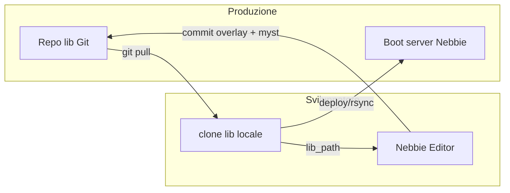

# Sincronizzazione lib tra installazioni editor

L'editor **non include** la lib di produzione. Ogni installazione punta a una cartella locale tramite `nebbieedit.conf` (`lib_path=...`). Questo documento spiega come evitare conflitti tra più builder e come allinearsi alla produzione.

## Modello dati (ricapito)

| Livello | Percorso | Ruolo |
|---------|----------|--------|
| Monolito | `myst.zon`, `myst.wld`, `myst.obj`, … | Catalogo base |
| Overlay | `zones/<indice>.zon`, `rooms/<vnum>`, `objects/<vnum>` | Sovrascrive/aggiunge singole entità (come il server) |
| Workspace editor | `.nebbie/workspace/`, `.nebbie/versions/` | Bozze locali, non viste dal server |

L'editor carica **monolito + overlay** nello stesso ordine del boot server.

## Chi ha la lib di produzione?

La lib reale (`mudroot/lib`) resta su:

- repository Git privato del team (consigliato)
- server di build / VM con `getworld`
- copia locale di chi ha accesso

**Non** va distribuita con l'installer dell'editor. L'app è vuota finché l'utente non configura `lib_path`.

## Workflow consigliato per il team



1. **Clone Git** della lib in una cartella locale (`~/nebbie-lib` o simile).
2. **`lib_path`** nell'editor punta a quella cartella.
3. **`git pull`** prima di lavorare — allineamento a produzione.
4. Modifiche in editor → commit su branch → review → merge nel repo lib.
5. Deploy sul server (rsync, CI, o procedura esistente del mud).

## Come evitare sovrapposizioni di vnum

### 1. Range per zona (regola principale)

Ogni zona ha `bottom`–`top` in `myst.zon`. **Stanze e oggetti di una zona devono usare vnum in quel range.**

- Zona 11 con range 1100–1199 → stanze `#1100`…`#1199`
- Il server e la validazione dell'editor segnalano uscite fuori range

### 2. Assegnazione vnum liberi

L'editor mostra già **vnum usati/liberi** nella mappa mondo (zone). Prima di creare:

1. Apri la zona interessata
2. Controlla vnum liberi nel pannello / mappa
3. Usa un vnum **libero** nel range della zona

### 3. Registry vnum (consigliato per team grandi)

File testuale nel repo lib, es. `VNUM_REGISTRY.md` o `vnum_alloc.json`:

```text
# Builder: Morgan — zona 42 (4200-4299)
4200-4210  stanze foresta (in lavorazione)
4211       riservato mob boss

# Builder: Alice — zona 180 (18000-18099)
18050-18080  città nuova
```

Aggiornamento **prima** di allocare, via PR sul repo lib — nessun codice mud richiesto.

### 4. Branch Git per builder

- `lib/main` = produzione
- `lib/builder/morgan-zona-42` = lavoro isolato
- Merge solo dopo review e test validazione

### 5. Senza lib di produzione (solo editor installato)

Possibili modalità:

| Modalità | Uso |
|----------|-----|
| **Lib scheletro** | Repo/template con zone vuote e range ampi riservati per nuove aree |
| **Nuova zona** | Aggiungi blocco in `myst.zon` con range **non usato** nel registry, poi stanze solo in quel range |
| **Workspace `.nebbie/`** | Prototipa in autosave; quando hai accesso alla lib, esporta/merge |

**Non** inventare vnum a caso nella fascia 3000–4000 se non sai cosa c'è in produzione — usa range dedicati documentati nel registry.

## Salvataggio: cosa tocca la produzione

| Azione editor oggi | Effetto su disco |
|--------------------|------------------|
| Salva (predefinito) | Riscrive solo `myst.*` presenti al load |
| Overlay già su disco | **Letti** all'apertura; **non** riscritti dal save attuale |
| Prossimo step (roadmap) | Save compatibile server → `rooms/`, `objects/`, `zones/` come `rsave`/`osave`/`zsave` |

Finché il save overlay non è implementato, le modifiche in editor vanno su `myst.*` o si usano i comandi in-game per gli overlay.

## Impatto sul codice del mud

| Componente | Modifica richiesta |
|------------|-------------------|
| Server Nebbie | **Nessuna** per load overlay (già supportato) |
| `mobiles/` | Fix server `read_mobile()` ancora consigliato prima di overlay mob |
| Editor | Load overlay ✅; save overlay in roadmap |
| Repo lib | Git + registry vnum (processo, non codice) |

## Checklist rapida per un nuovo builder

1. Ottieni accesso al repo lib (o lib scheletro con range assegnati).
2. `git clone` → configura `lib_path` nell'editor.
3. Leggi `VNUM_REGISTRY` e prenota il tuo range.
4. `git pull` prima di ogni sessione.
5. Crea stanze/mob/obj **solo** nel range assegnato.
6. Valida in editor (tab Validazione) prima del commit.
7. PR sul repo lib → review → merge → deploy server.
